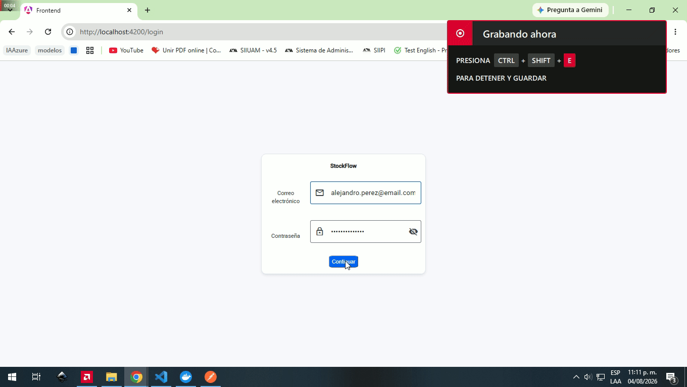
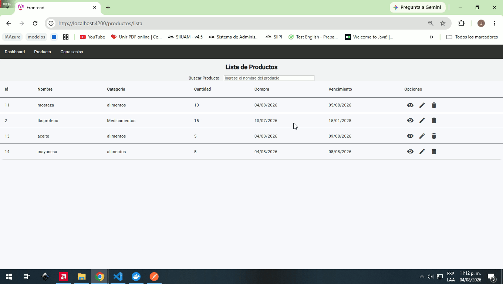
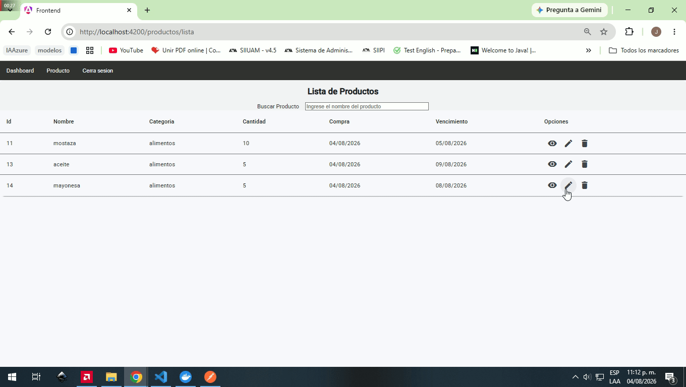
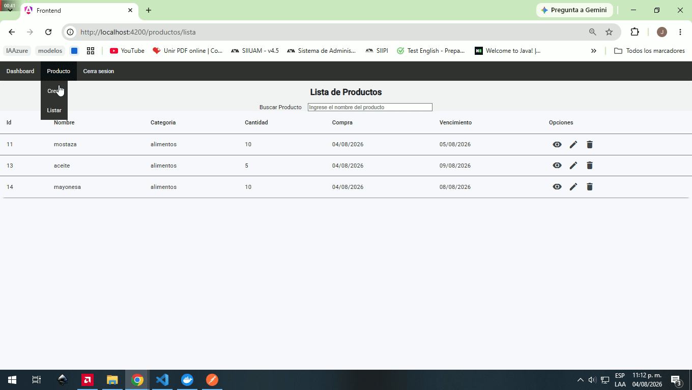

# StockFlow

## DESCRIPCIÓN
StockFlow es una aplicación Full Stack desarrollada para gestionar inventarios de productos, permitiendo controlar existencias, fechas de compra y vencimiento mediante una interfaz moderna y una arquitectura escalable.

## GIF





## Características

- Autenticación mediante JWT.
- Dashboard con indicadores del inventario.
- CRUD completo de productos.
- Búsqueda dinámica con debounce.
- Detalle de productos mediante Web Components (Lit).
- Formularios reactivos con validaciones.
- Arquitectura modular en frontend y backend.

## ARQUITECTURA
``` text
Angular

↓

Interceptor JWT

↓

Express

↓

Controller

↓

Service

↓

Repository

↓

PostgreSQL
```
El frontend consume una API REST protegida mediante JWT. Las solicitudes autenticadas son interceptadas por un interceptor HTTP que adjunta automáticamente el token. El backend implementa una arquitectura por capas para separar responsabilidades entre la capa HTTP, la lógica de negocio y el acceso a datos. Además, el detalle de productos se implementó mediante un Web Component desarrollado con Lit e integrado dentro de Angular.

## TECNOLOGIA
| Tecnología       | Uso                 |
| ---------------- | ------------------- |
| Angular          | Frontend            |
| Angular Material | UI                  |
| Lit              | Web Components      |
| Node.js          | Backend             |
| Express          | API REST            |
| PostgreSQL       | Base de datos       |
| JWT              | Autenticación       |
| Docker           | Contenedor de la BD |


## INSTALACION
Requisitos

Antes de comenzar, asegúrate de tener instalado:

Node.js (versión v22.14.0 o superior)
Angular CLI (version 20.3.32 o superior)
Docker Desktop
Git

1.- Clonar el repositorio
```bash
git clone https://github.com/yayojair/StockFlow.git
```

2.- Levanta PostgreSQL utilizando Docker Compose:

```bash
docker compose up -d
```
> **Nota:** La base de datos incluye datos de prueba (backend/data-base/seed.sql) para facilitar la evaluación de la aplicación. Al iniciar el contenedor podrás acceder directamente al sistema sin necesidad de registrar productos manualmente.

**Credenciales de prueba**

Email:
```text
alejandro.perez@email.com
```

Contraseña:
```text
StockFlow2026!
```

3.- Backend


```bash
cd backend
npm install
npm run dev
```

4 .- Frontend
```bash
cd frontend

npm install

ng serve
```

## FUTURAS MEJORAS
- Paginación del lado del servidor.
- Ordenamiento dinámico.
- Refresh Tokens.
- Docker Compose para toda la aplicación.
- Pruebas unitarias.
- Despliegue en la nube.

## AUTOR
EDGAR JAIR MARTINEZ RUIZ